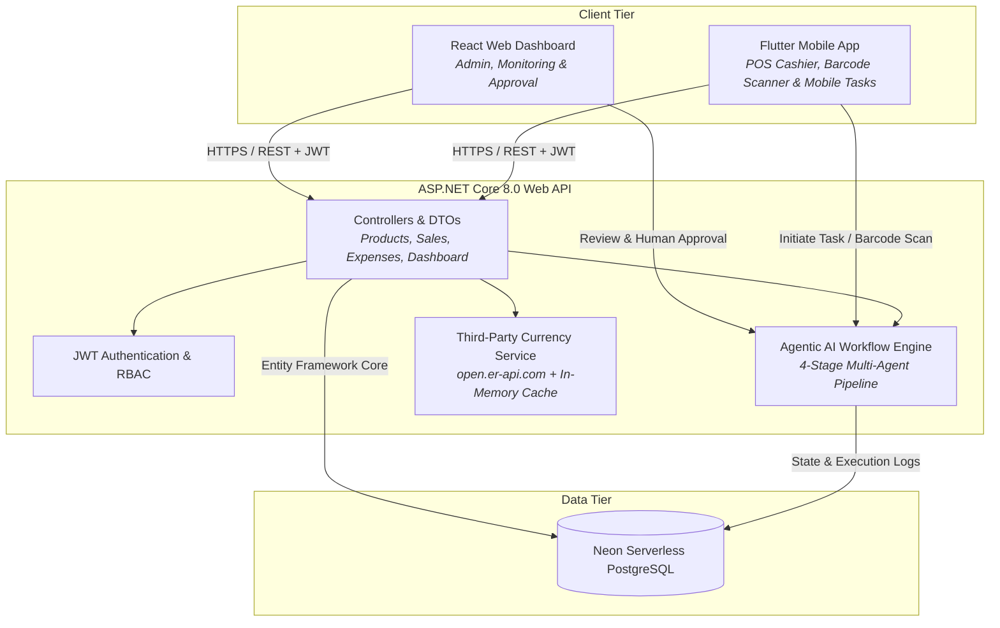
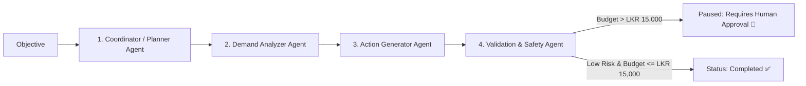

# BizTrack LK 🇱🇰

> **Integrated Full-Stack and Agentic AI Management Platform for Sri Lankan Retail & SME Businesses**  
> Developed for **SLIIT SE3090 – Software Engineering Frameworks (Assignment 1, 2026)**

---

## 1. Project Overview & Business Domain

**BizTrack LK** is an enterprise-grade, integrated multi-client management system designed specifically for Sri Lankan retail and wholesale grocery merchants. Small and medium enterprises (SMEs) across Sri Lanka traditionally struggle with manual ledger books, untracked procurement costs (COGS), fluctuating supplier prices, and unmonitored stock-outs of critical household staples (such as Samba Rice, Mysoor Dhal, and Ceylon Tea).

BizTrack LK unites **Web Administration**, **Mobile Point-of-Sale (POS)**, a **Secure RESTful API**, an **Online Relational Database**, and an **Autonomous Agentic AI Workflow Engine** into a single cohesive platform.

---

## 2. Integrated System Architecture



### Key Architectural Standards
* **Single Backend Rule:** Both React and Flutter clients consume the **exact same ASP.NET Core Web API**, sharing user identities, database models, permissions, and business rules.
* **Closed Third-Party Routing:** External exchange rate calls (`open.er-api.com`) are routed exclusively through the ASP.NET Core backend with in-memory caching and resilient fallback rates.
* **Deterministic Safety Boundaries:** High-impact financial commitments ($\ge$ LKR 15,000.00) generated by the Agentic AI automatically pause for human executive sign-off.

---

## 3. Technology Stack

| Layer | Framework / Technology | Version / Tooling |
| :--- | :--- | :--- |
| **Backend API** | C# / ASP.NET Core Web API | .NET 8.0, Entity Framework Core, BCrypt.Net, JWT Bearer |
| **Database** | PostgreSQL | Neon Serverless PostgreSQL with SSL (`sslmode=require`) |
| **Web Frontend** | React.js (SPA) | React 18, Vite, React Router DOM, Vitest, Context API |
| **Mobile App** | Flutter & Dart | Flutter 3.x, Provider, Mobile Scanner, Secure Storage |
| **Agentic AI** | Custom Multi-Agent Engine | C# Deterministic Rules Engine, Allow-listed Tools, Audit Logs |
| **CI / CD** | GitHub Actions | Automated build, test suites for .NET, React, and Flutter |

---

## 4. User Roles & Security Matrix

BizTrack LK enforces strict **Role-Based Access Control (RBAC)**:

| Role | Username | Password | Key Responsibilities |
| :--- | :--- | :--- | :--- |
| **System Admin** | `admin` | `Admin123!` | Executive dashboard, system users, approving/rejecting agent restock workflows. |
| **Inventory Manager** | `manager` | `Manager123!` | Product catalog management, reorder thresholds, inventory adjustments, and restock planning. |
| **POS Cashier** | `cashier` | `Cashier123!` | Point-of-sale checkout, customer orders, cash/card collection, and mobile barcode scanning. |

*Default accounts are automatically seeded into the database on API startup.*

---

## 5. Four Primary Business Components (Group Allocation)

In accordance with Section 3 and 4 of the SE3090 specification, four primary business components are implemented:

1. **Component A: Product Catalog & Stock Governance**
   - CRUD operations, search, category filters, reorder-level alerts, server-side pagination, and stock deficit calculations.
2. **Component B: Point-of-Sale (POS) & Sales Transaction Processing**
   - Multi-item checkout, atomic stock decrements inside database transactions, customer invoice generation, payment methods (Cash, Card, Bank Transfer).
3. **Component C: Operational Expenditures & Financial Tracking**
   - Categorized operational outflows (Rent, CEB Electricity, Transport), date filtering, pagination, and expenditure audit trails.
4. **Component D: Executive Analytics & Agentic AI Orchestration**
   - Real-time gross and net profit computation, 4-agent replenishment pipeline, human-in-the-loop approval gates, and execution logging.

---

## 6. Agentic AI Subsystem Overview

The Agentic AI subsystem is a multi-agent orchestration pipeline ([AgentWorkflowEngine.cs](file:///c:/Users/vasan/OneDrive/Desktop/biztrack-lk/backend/Services/AgentWorkflowEngine.cs)):



1. **`CoordinatorPlannerAgent`:** Deconstructs business objectives into a 3-stage structured plan.
2. **`DemandAnalyzerAgent`:** Queries database deficits for products where `stock_quantity <= reorder_level`.
3. **`ActionGeneratorAgent`:** Uses allow-listed pricing tools to formulate concrete restock purchase orders and total LKR budget commitments.
4. **`ValidationSafetyAgent`:** Enforces deterministic business boundaries. If proposed capital expenditure exceeds **LKR 15,000.00**, it pauses the workflow, flags risk as `High`, and waits for authorized sign-off in the React dashboard.

---

## 7. Architecture Decision Records (ADRs)

Detailed records capturing architectural rationale and alternatives are located in [`docs/adrs/`](file:///c:/Users/vasan/OneDrive/Desktop/biztrack-lk/docs/adrs/):
- **[ADR-001: React State Management](file:///c:/Users/vasan/OneDrive/Desktop/biztrack-lk/docs/adrs/ADR-001-react-state-management.md)** (Context API + Custom Hooks)
- **[ADR-002: Flutter State Management](file:///c:/Users/vasan/OneDrive/Desktop/biztrack-lk/docs/adrs/ADR-002-flutter-state-management.md)** (Provider + Secure Storage)
- **[ADR-003: Agentic AI Orchestration](file:///c:/Users/vasan/OneDrive/Desktop/biztrack-lk/docs/adrs/ADR-003-agentic-ai-orchestration.md)** (Native C# Multi-Agent Engine + Safety Gate)
- **[ADR-004: PostgreSQL Agent State Schema](file:///c:/Users/vasan/OneDrive/Desktop/biztrack-lk/docs/adrs/ADR-004-postgresql-agent-state-schema.md)** (Normalized Relational Entity Triad)
- **[ADR-005: Third-Party Currency Service](file:///c:/Users/vasan/OneDrive/Desktop/biztrack-lk/docs/adrs/ADR-005-third-party-currency-service.md)** (Open Exchange Rates API + In-Memory Caching)

---

## 8. Installation & Running Locally

### Prerequisites
- [.NET 8.0 SDK](https://dotnet.microsoft.com/download/dotnet/8.0)
- [Node.js v18+](https://nodejs.org/)
- [Flutter SDK 3.x](https://flutter.dev/) (for mobile)
- Git

### 1. ASP.NET Core Backend
```bash
# Navigate to backend and run
cd backend
dotnet run
```
* The API will listen on `http://localhost:5000`.
* Interactive Swagger API documentation: `http://localhost:5000/swagger`.
* Health check: `http://localhost:5000/api/health`.

### 2. React Web Client
```bash
# Navigate to frontend and start Vite dev server
cd frontend
npm install
npm run dev
```
* Web application available at `http://localhost:5173`.

### 3. Flutter Mobile Client
```bash
# Navigate to mobile and run
cd mobile
flutter pub get
flutter run
```

---

## 9. Automated Testing & Verification

Automated test suites cover all layers of the platform:

```bash
# 1. Run Backend & Agentic AI Tests (9 passing tests)
dotnet test tests/BizTrack.Api.Tests/BizTrack.Api.Tests.csproj

# 2. Run React Web Tests (6 passing tests)
cd frontend && npm test

# 3. Run Flutter Mobile Tests (4 passing tests)
cd mobile && flutter test

# 4. Run Concurrent Performance Benchmark
node tests/performance/benchmark.js
```

---

## 10. Continuous Integration (CI)

The repository is equipped with an automated GitHub Actions CI pipeline ([`.github/workflows/ci.yml`](file:///c:/Users/vasan/OneDrive/Desktop/biztrack-lk/.github/workflows/ci.yml)):
- Builds the ASP.NET Core Web API in `Release` mode and executes xUnit tests.
- Verifies the React client using Vitest and builds the production bundle (`npm run build`).
- Sets up Flutter SDK and runs `flutter test`.
