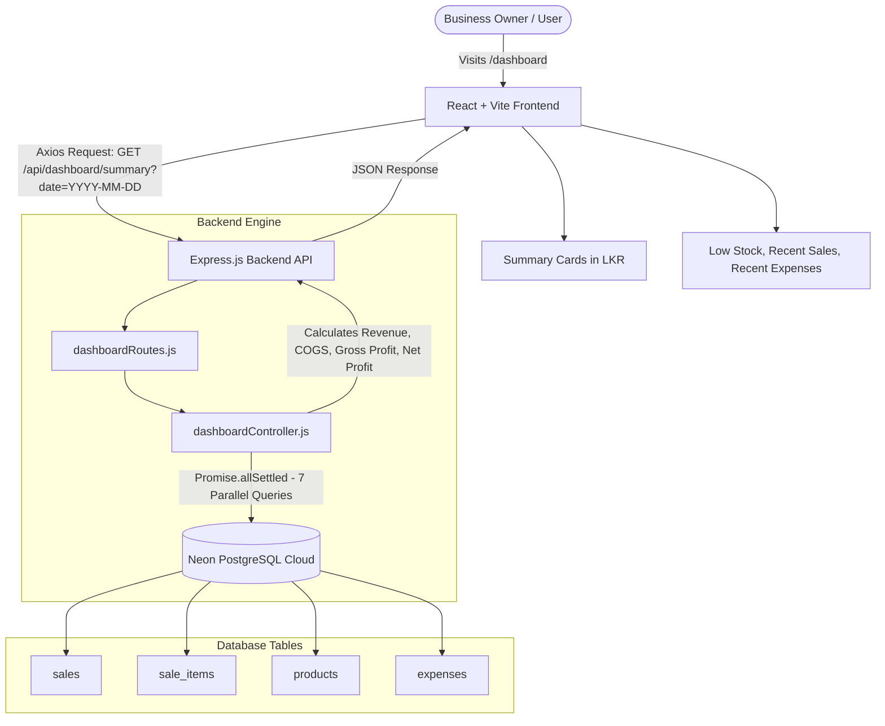

# BizTrack LK - Member 4 Technical Documentation

**Author / Role:** Member 4 - Full-Stack Dashboard Integration & Shared Navigation  
**Project:** BizTrack LK (University Mini-Hackathon)  
**Technology Stack:** React.js (Vite) + Node.js (Express) + Neon PostgreSQL (`pg`) + Axios + React Router

---

## 1. Architectural Overview & System Flow

Member 4 is responsible for integrating all subsystems (Products, Sales, Expenses) into an **Executive Dashboard** that provides business owners with real-time financial health monitoring.



---

## 2. Backend Deep-Dive & Function Breakdown

### A. Database Connection Pool (`backend/src/config/database.js`)

```javascript
const { Pool } = require('pg');

const isPlaceholderUrl = (url) => {
  if (!url) return true;
  return url.includes('username:password@host') || url.includes('your-host');
};

const hasValidUrl = process.env.DATABASE_URL && !isPlaceholderUrl(process.env.DATABASE_URL);

const pool = new Pool({
  connectionString: hasValidUrl ? process.env.DATABASE_URL : undefined,
  connectionTimeoutMillis: 5000,
  ssl: hasValidUrl ? { rejectUnauthorized: false } : false
});

module.exports = pool;
```

#### How it works:
1. **`Pool` from `pg`:** Rather than opening and closing database connections on every HTTP request, a connection pool maintains reusable TCP connections to Neon PostgreSQL, improving speed and avoiding connection exhaustion.
2. **`isPlaceholderUrl` Protection:** Automatically checks if `DATABASE_URL` is still the dummy `.env.example` string. If so, it prevents the app from hanging or throwing unhandled connection errors.
3. **`connectionTimeoutMillis: 5000`:** Sets a maximum 5-second connection timeout so network stalls never cause infinite request freezes.
4. **`ssl: { rejectUnauthorized: false }`:** Neon is a cloud database requiring SSL/TLS encryption. This setting enables secure SSL communication across the internet.

---

### B. Dashboard Controller (`backend/src/controllers/dashboardController.js`)

**Primary Function:** `getDashboardSummary(req, res, next)`

```javascript
const getDashboardSummary = async (req, res, next) => { ... }
```

#### Step-by-Step Logic:

1. **Date Parameter Extraction:**
   ```javascript
   const { date } = req.query;
   const dateFilter = date ? String(date).trim() : null;
   ```
   Reads optional `?date=YYYY-MM-DD` from the query string. If omitted, `dateFilter` is `null` (representing all-time data).

2. **High-Performance Parallel Execution (`Promise.allSettled`):**
   Instead of running 7 database queries sequentially (which would take 7 roundtrips across the internet to Neon), all queries run concurrently in parallel:
   ```javascript
   const [
     revenueResult,
     cogsResult,
     expenseResult,
     productsCountResult,
     lowStockResult,
     recentSalesResult,
     recentExpensesResult
   ] = await Promise.allSettled([
     revenuePromise,
     cogsPromise,
     expensePromise,
     productsCountPromise,
     lowStockPromise,
     recentSalesPromise,
     recentExpensesPromise
   ]);
   ```
   **Why `Promise.allSettled` instead of `Promise.all`?**  
   If one table (e.g. `expenses`) does not exist or fails, `Promise.all` would fail the entire request. `Promise.allSettled` allows surviving queries to succeed while falling back to `0` for missing tables.

3. **Parameterized SQL Queries:**

   - **Total Revenue:**
     ```sql
     SELECT COALESCE(SUM(total_amount), 0) AS total_revenue
     FROM sales
     WHERE LOWER(COALESCE(status, 'completed')) != 'cancelled'
       AND ($1::date IS NULL OR DATE(COALESCE(created_at, sale_date, NOW())) = $1::date)
     ```
     *Rule:* Excludes cancelled sales. If date is provided, filters by that date.

   - **Cost of Goods Sold (COGS):**
     ```sql
     SELECT COALESCE(SUM(si.quantity * COALESCE(si.unit_cost, p.unit_cost, 0)), 0) AS total_cogs
     FROM sale_items si
     JOIN sales s ON si.sale_id = s.id
     LEFT JOIN products p ON si.product_id = p.id
     WHERE LOWER(COALESCE(status, 'completed')) != 'cancelled'
       AND ($1::date IS NULL OR DATE(COALESCE(s.created_at, s.sale_date, NOW())) = $1::date)
     ```
     *Rule:* Multiplies sale item quantity by procurement cost.

   - **Operating Expenses:**
     ```sql
     SELECT COALESCE(SUM(amount), 0) AS total_expenses
     FROM expenses
     WHERE ($1::date IS NULL OR DATE(COALESCE(expense_date, created_at, NOW())) = $1::date)
     ```

   - **Active & Low Stock Counts:**
     ```sql
     SELECT 
       COUNT(CASE WHEN is_active = true OR status = 'active' OR (status IS NULL AND is_active IS NULL) THEN 1 END) AS active_count,
       COUNT(CASE WHEN stock_quantity <= COALESCE(low_stock_threshold, 10) THEN 1 END) AS low_stock_count
     FROM products
     ```

4. **Financial Computations:**
   ```javascript
   const grossProfit = Number((revenue - costOfGoodsSold).toFixed(2));
   const estimatedProfit = Number((revenue - costOfGoodsSold - expenses).toFixed(2));
   ```
   - **Gross Profit** = $\text{Revenue} - \text{COGS}$
   - **Estimated Net Profit** = $\text{Gross Profit} - \text{Expenses} = \text{Revenue} - \text{COGS} - \text{Expenses}$

---

### C. Backend Express Wiring (`backend/src/app.js`)

- Configures security middleware (`helmet()`).
- Configures dynamic CORS (`origin: process.env.FRONTEND_URL || 'http://localhost:5173'`).
- Mounts all route subsystems:
  - `/api/health` ➔ Health check
  - `/api/dashboard` ➔ Dashboard aggregation
  - `/api/products` ➔ Products CRUD stub
  - `/api/sales` ➔ Sales orders stub
  - `/api/expenses` ➔ Expenses tracking stub
- Central 404 (`notFound.js`) and error-handling middleware (`errorHandler.js`).

---

## 3. Frontend Deep-Dive & Component Breakdown

### A. API Service (`frontend/src/services/dashboardService.js`)

- **`getDashboardSummary(date)`:** Uses the centralized Axios instance (`api.js`) to call `/dashboard/summary`. Automatically appends `?date=YYYY-MM-DD` if a date is selected.
- **`formatLKR(value)`:**
  ```javascript
  export const formatLKR = (value) => {
    const num = Number(value) || 0;
    return `LKR ${num.toLocaleString('en-LK', {
      minimumFractionDigits: 2,
      maximumFractionDigits: 2
    })}`;
  };
  ```
  Formats raw numbers into official Sri Lankan Rupee currency format (e.g. `12500.5` ➔ `"LKR 12,500.50"`).

---

### B. Dashboard Page (`frontend/src/pages/DashboardPage.jsx`)

Main controller component managing UI lifecycle:
- **`useState` Hooks:**
  - `summary`: Stores current metric data payload.
  - `loading`: Controls the loading spinner animation.
  - `error`: Stores any network or server error messages.
  - `selectedDate`: Stores the user's chosen date filter.
- **`useCallback` & `useEffect`:**
  Automatically triggers data fetching when the page mounts or whenever `selectedDate` changes.
- **Interactive Controls:**
  - **Date Picker:** Selects a specific date to view daily metrics.
  - **Clear Button:** Resets the filter back to all-time overview.
  - **Refresh Button (`🔄`):** Re-fetches the latest numbers on demand.
  - **Retry Banner:** Appears on network failure with an instant retry action.

---

### C. Dashboard Components (`frontend/src/components/dashboard/`)

1. **`SummaryCard.jsx`:**
   Reusable metric card with color variant accents:
   - Revenue (Cyan/Blue)
   - Cost of Goods Sold (Orange)
   - Gross Profit (Emerald Green)
   - Expenses (Rose/Red)
   - Net Profit (Bright Green if positive, Red if negative)
   - Active Catalog & Low Stock Warning (Amber Yellow)

2. **`LowStockList.jsx`:**
   Displays table of inventory items below safety threshold with stock levels and warning badges. Displays a clean green checkmark empty-state when all inventory is well-stocked.

3. **`RecentSales.jsx`:**
   Displays completed sales invoices, timestamps, status badges, and transaction amounts in LKR.

4. **`RecentExpenses.jsx`:**
   Displays operational expense category badges (Utilities, Rent, Logistics), descriptions, and expenditure amounts in LKR.

---

### D. Navigation & Routing (`frontend/src/components/Navbar.jsx` & `frontend/src/App.jsx`)

- **`Navbar.jsx`:** Sticky navigation bar with mobile hamburger menu toggle (`isOpen`), responsive collapse under 768px, and active route styling.
- **`HomePage.jsx`:** Presentation landing page tailored for Sri Lankan small businesses:
  - Explains the local challenge (paper books, currency fluctuations, untracked COGS).
  - Outlines the BizTrack LK digital solution.
  - Highlights core features and provides instant CTA navigation buttons.
- **`App.jsx`:** Wraps everything in `BrowserRouter` and routes `/`, `/dashboard`, `/inventory`, `/sales`, and `/expenses`.

---

## 4. Deployment Architecture

| Tier | Platform | Key Configuration |
| :--- | :--- | :--- |
| **Backend** | **Railway** | Root directory: `/backend`, Command: `npm start`, Env: `PORT`, `DATABASE_URL`, `FRONTEND_URL` |
| **Frontend** | **Vercel** | Root directory: `/frontend`, Build: `npm run build`, Rewrites: `vercel.json` (SPA routing) |
| **Database** | **Neon** | Serverless PostgreSQL with SSL enabled (`sslmode=require`) |

---

## 5. Potential Hackathon Viva / Presentation Questions

### Q1: "How do you calculate Gross Profit vs. Estimated Net Profit?"
> *"Gross Profit is calculated as `Total Revenue - Cost of Goods Sold (COGS)`. COGS represents the direct procurement cost of items that were sold. Estimated Net Profit goes one step further by deducting operational overheads: `Gross Profit - Operating Expenses`."*

### Q2: "How does the backend prevent slow response times when querying multiple tables across the internet to Neon?"
> *"Instead of sequential `await` queries that cause 7 consecutive roundtrip delays, we use `Promise.allSettled` to execute all 7 SQL queries concurrently in parallel. This cuts response time from ~10–15 seconds down to ~1–2 seconds."*

### Q3: "What happens if a teammate hasn't created the `expenses` or `sales` table yet?"
> *"Our queries are wrapped in defensive try-catch handlers within `Promise.allSettled`. If a table does not exist, the controller catches the warning and safely defaults to `0` or an empty list `[]`, returning a valid 200 OK JSON response without crashing the server or breaking the UI."*

### Q4: "How does the single-page application (SPA) handle page refreshes in production?"
> *"We configured `frontend/vercel.json` with a rewrite rule that redirects all subpaths (`/(.*)`) to `index.html`. This ensures that when a user refreshes on `/dashboard` or `/inventory`, Vercel serves the React application rather than a 404 error."*
